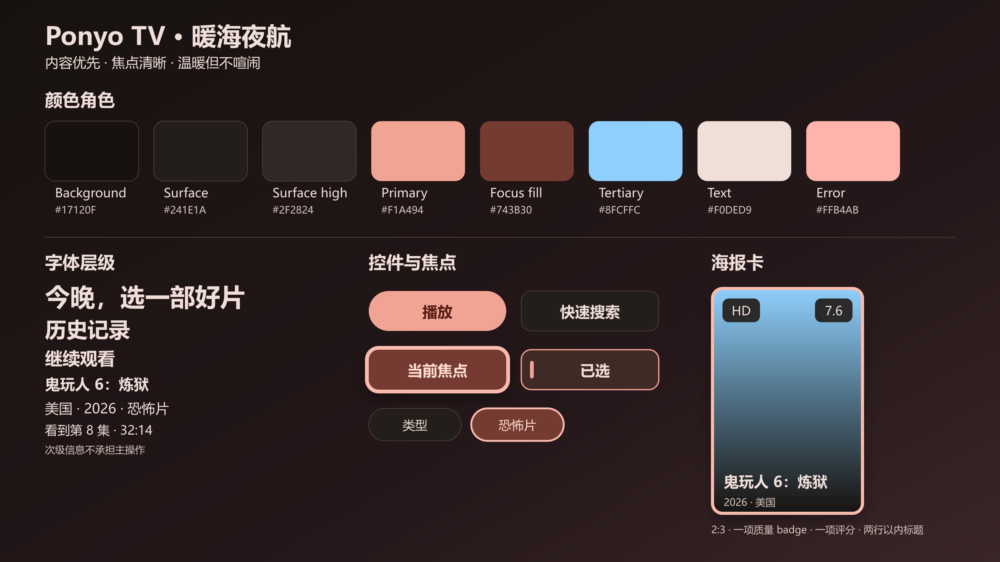

# Ponyo TV UI 二次修复计划（V2）

> 日期：2026-08-10  
> 性质：修复计划与验收基线，不包含代码修改  
> 对照基线：[全页面视觉审计与深度美化方案](ponyo-tv-ui-deep-beautification-audit.md)、[全页面样式审计与深度美化方案](PONYO_TV_DEEP_VISUAL_REDESIGN.md)  
> 实施现状：[P0/P1/P2 实施跟踪](实施记录/IMPLEMENTATION.md)及同目录 33 张截图  
> 当前验证版本：com.darkings.ponyotv，Ponyo-20260724-beauty2.4（versionCode 202607245）

## 1. 计划结论

上一轮实施保留了几项有效成果：海报基础比例已接近 2:3、播放器会隐藏 0bps 与 0×0、首页悬浮角色已隐藏、部分语义色与焦点描边已统一。但“完成”记录中的大多数页面只完成了换色、尺寸微调或单帧可见性验证，尚未达到原方案规定的信息架构、状态恢复和 TV 遥控器可用性。

本轮不得继续按“页面能打开或文字已换色”判定完成。修复顺序调整为：

1. P0：先消除遥控器阻断、敏感信息外露、播放器遮挡、无恢复状态和危险操作歧义。
2. P1：完成首页、详情、搜索、直播、工具页和全部 Dialog 的信息层级重构。
3. P2：完成 Splash 连续性、减动效、条件式骨架屏、多分辨率和真机回归。

P0 全部门禁通过前不得进入 P1；P1 页面级门禁通过前不得投入 P2 动效精修。角色继续保持隐藏，不作为当前修复的装饰性目标。

## 2. 取证范围与现状判定

### 2.1 已核对证据

- 已逐项核对 [实施记录](实施记录/IMPLEMENTATION.md)。
- 已查看实施记录目录的 33 张截图；其中 [P0-2-Empty-空结果.png](实施记录/P0-2-Empty-空结果.png) 与 [P0-2-Empty-空结果2.png](实施记录/P0-2-Empty-空结果2.png) 内容重复，实际为 32 张唯一画面。
- 已对照原方案、页面覆盖表、文案表、动效表、资源映射和 QA 清单。
- 已通过 ADB 检查 1920×1080、density 280 的雷电模拟器，并读取当前 Activity、焦点节点和 UI hierarchy。
- ADB 只用于取证：未安装 APK、未改变设置值、未修改分辨率或设备配置。

### 2.2 上一轮任务复核矩阵

| 原任务 | 复核结论 | 证据 | V2 处理 |
| --- | --- | --- | --- |
| P0-1 详情按钮色 | 部分完成 | [按钮改色](实施记录/P0-1-详情页-按钮改色后.png)、[焦点态](实施记录/P0-1-详情页-焦点态.png)仍显示原始播放 URL，“全屏”仍充当主操作，四个按钮仍以多套语义色竞争 | 重开为 V2-P0-2，并在 P1 完成 5:7 与线路/选集 |
| P0-2 Loading/Empty/Error | 部分完成且缺 Error | [加载](实施记录/P0-2-Loading-加载中.png)、[慢网](实施记录/P0-2-Loading-慢网提示.png)、[空结果](实施记录/P0-2-Empty-空结果.png)均为泛化模板；飞行模式画面不能证明断网；代码中没有统一 ErrorCallback | 重开为 V2-P0-4 |
| P0-3 海报 2:3 | 比例完成，信息降噪未完成 | [热门电影](实施记录/P0-3-海报2比3-热门电影.png)仍显示评分 0、长推荐语、标题等多层覆盖 | 保留比例成果，重开为 V2-P0-5 |
| P0-4 设置分组 | 未通过，属于阻断缺陷 | [设置分组](实施记录/P0-4-设置页-分组.png)、[滚动画面](实施记录/P0-4-设置页-分组-滚动2.png)未证明六组导航；ADB 证明屏下项目不可达 | 提升为 V2-P0-1 |
| P0-5 播放器技术值 | 局部完成 | [技术值](实施记录/P0-5-播放器-技术值.png)已隐藏无效值；[控制层](实施记录/P0-5-播放器-技术值-控制层.png)仍按钮过载，并与字幕重叠 | 重开为 V2-P0-3 |
| P0-6 角色收敛 | 当前结果可保留 | [角色隐藏](实施记录/P0-6-首页-角色隐藏.png)避免遮挡；过程截图也说明不能仅凭“精灵图损坏”恢复或替换 | 继续隐藏，P2 仅做启用条件审查 |
| P0-7 焦点验证 | 证据不足 | [内容卡焦点](实施记录/P0-7-焦点-内容卡片.png)只覆盖单个焦点态，不能证明完整路径、边界、返回恢复 | 纳入每一任务的 ADB 门禁 |
| P1-1 首页重排 | 部分完成 | [分类 Tab](实施记录/P1-1-首页-分类tab完整.png)可见但过密；首屏海报仍有评分 0 与文字噪声，第二行在视口边缘被裁切 | V2-P1-1 |
| P1-2 详情层级 | 未完成 | [首屏](实施记录/P1-2-详情页-首屏.png)、[选集区](实施记录/P1-2-详情页-选集区.png)仍有大空白、短码线路和单个“正片”；[选集层级](实施记录/P1-2-详情页-选集层级.png)实际是首页误标图 | V2-P1-2 |
| P1-3 搜索 | 仅换色 | [搜索页](实施记录/P1-3-搜索页.png)仍是三列同权、操作过载、删除图标无文字 | V2-P1-3 |
| P1-4 聚合搜索 | 证据无效 | [聚合搜索](实施记录/P1-4-聚合搜索.png)只证明 Loading，没有结果卡、筛选、结束、失败、无结果与焦点证据 | V2-P1-4 |
| P1-5 历史/收藏 | 部分完成 | [历史](实施记录/P1-5-历史页.png)仍叠加来源/进度/标题；[收藏](实施记录/P1-5-收藏页.png)是没有说明和操作的纯空页 | V2-P0-6 与 V2-P1-5 |
| P1-6 直播 | 证据无效 | [直播页](实施记录/P1-6-直播页.png)只显示通用 Loading，未证明频道抽屉、EPG、线路、设置和换台 | V2-P1-6 |
| P2-1 Splash | 证据不足 | [Splash](实施记录/P2-1-Splash.png)是单帧，副标题仍为“专属电视影院”，未证明系统 Preview 到 Activity 首帧连续性和 700–900ms 时序 | V2-P2-1 |
| P2-2 焦点动效 | 部分完成 | 单张焦点图不能证明 120ms、P95 帧时间、按下态和边界无裁切 | V2-P2-2 与全量 QA |
| P2-3 骨架屏 | 已暂缓 | 核心可用性尚未完成，不应抢先增加动效复杂度 | 维持条件式延期 |
| P2-4 减少动态效果 | 未验证且入口不可达 | 实施记录承认外观组在屏下；当前遥控器路径无法到达对应项目 | V2-P0-1 先恢复入口，V2-P2-2 再验证行为 |
| P2-5 多分辨率 | 未通过 | [720p-首页](实施记录/P2-5-720p-首页.png)实际是 720p Loading，不是首页内容态；无 720p 详情/设置/播放器，也无 4K | V2-P2-4 |

### 2.3 ADB 新发现的 P0 阻断

当前设置页不是“滚动比较慢”，而是纯遥控器路径中断：

- 从设置首项进入右侧后，连续 18 次 KEYCODE_DPAD_DOWN，焦点停在 llScale，bounds 为 [1103,804][1463,894]。
- 再按右键后焦点进入 showPreview；继续按下键，焦点不再移动。
- 屏下的“数据与关于”“减少动态效果”等项目不能通过 DPAD 到达。
- 左侧只显示“设置其他”，并没有原方案要求的“通用、内容、播放、网络、外观、数据与关于”六组。

因此 V2-P0-1 是所有后续工作的前置条件。

## 3. 已提供的实施资料

本计划不依赖尚未提供的设计稿、插画、字体、音效或图标。所有输入资料均已在仓库中提供，实施时必须直接复用下表，不得以“缺少素材”为由自行引入来源不明的文件。

| 资料 | 用途 | 已提供路径 |
| --- | --- | --- |
| 视觉审计主方案 | 页面目标、问题证据、实施顺序、完成定义 | [ponyo-tv-ui-deep-beautification-audit.md](ponyo-tv-ui-deep-beautification-audit.md) |
| 深度重构方案 | 页面信息架构、组件级规则、性能和回归标准 | [PONYO_TV_DEEP_VISUAL_REDESIGN.md](PONYO_TV_DEEP_VISUAL_REDESIGN.md) |
| 视觉令牌 | 颜色、字体、间距、安全区、5:7 栅格、焦点、海报与按钮尺寸 | [design-tokens.json](materials/design-tokens.json) |
| 正式文案 | 11 个 Activity、通用状态、主要操作、20 个 Dialog 文案 | [copy-deck.json](materials/copy-deck.json) |
| 动效参数 | 焦点、页面、Dialog、Loading、角色与 reduced motion | [motion-spec.json](materials/motion-spec.json) |
| 可编辑视觉板 | 颜色、层级和组件参考 | [style-board.svg](materials/style-board.svg) |
| 已渲染视觉板 | 3200×1800 视觉核对图 | [style-board.png](materials/style-board.png) |
| 品牌资产说明 | App 图标、Banner、背景、角色、占位图、字体来源与授权边界 | [brand-assets.md](materials/brand-assets.md) |
| 页面证据判定 | 44 张早期截图的真实页面、误标和有效性结论 | [screen-coverage.csv](materials/screen-coverage.csv) |
| 资源映射 | 页面、Activity、layout、组件与资料的逐项映射 | [resource-map.tsv](materials/resource-map.tsv) |
| QA 清单 | 720p/1080p/4K、遥控器、弱网、状态、Dialog、截图验收 | [qa-checklist.md](materials/qa-checklist.md) |
| 可复用 Android 资源 | 现有 vector、drawable、layout 参考与生成脚本 | [tools/md3_res/README.md](../../../tools/md3_res/README.md) |
| 图标字体许可证 | Material Symbols Apache-2.0 许可文本 | [LICENSE-MATERIAL-SYMBOLS.txt](../../../tools/md3_res/LICENSE-MATERIAL-SYMBOLS.txt) |
| 上一轮结果与截图 | 现状基线和回归对照 | [IMPLEMENTATION.md](实施记录/IMPLEMENTATION.md) |

视觉实施以这张已交付视觉板为准：

### 3.1 可直接复用的核心资源

- 状态： [icon_loading.xml](../../../tools/md3_res/icon_loading.xml)、[icon_empty.xml](../../../tools/md3_res/icon_empty.xml)、[icon_error.xml](../../../tools/md3_res/icon_error.xml)、[icon_img_placeholder.xml](../../../tools/md3_res/icon_img_placeholder.xml)。
- 导航与动作： [icon_back.xml](../../../tools/md3_res/icon_back.xml)、[icon_clear.xml](../../../tools/md3_res/icon_clear.xml)、[icon_delete.xml](../../../tools/md3_res/icon_delete.xml)、[icon_filter.xml](../../../tools/md3_res/icon_filter.xml)、[icon_filter_off.xml](../../../tools/md3_res/icon_filter_off.xml)。
- 页面入口： [icon_history.xml](../../../tools/md3_res/icon_history.xml)、[icon_live.xml](../../../tools/md3_res/icon_live.xml)、[icon_search.xml](../../../tools/md3_res/icon_search.xml)、[icon_push.xml](../../../tools/md3_res/icon_push.xml)、[icon_collect.xml](../../../tools/md3_res/icon_collect.xml)、[icon_setting.xml](../../../tools/md3_res/icon_setting.xml)。
- 播放： [icon_play.xml](../../../tools/md3_res/icon_play.xml)、[icon_pre.xml](../../../tools/md3_res/icon_pre.xml)、[icon_lock.xml](../../../tools/md3_res/icon_lock.xml)、[icon_unlock.xml](../../../tools/md3_res/icon_unlock.xml)、[icon_video.xml](../../../tools/md3_res/icon_video.xml)。
- 容器与组件： [ponyo_panel.xml](../../../tools/md3_res/ponyo_panel.xml)、[ponyo_poster_surface.xml](../../../tools/md3_res/ponyo_poster_surface.xml)、[ponyo_top_bar.xml](../../../tools/md3_res/ponyo_top_bar.xml)、[button_detail_play.xml](../../../tools/md3_res/button_detail_play.xml)、[button_dialog_main.xml](../../../tools/md3_res/button_dialog_main.xml)、[bg_dialog_rounded.xml](../../../tools/md3_res/bg_dialog_rounded.xml)。

运行时海报、详情 backdrop、直播台标和 QR 内容由业务数据生成，不属于缺失素材。其裁切、占位、quiet zone 和失败回退规则已经写入 [brand-assets.md](materials/brand-assets.md)，不得另等设计稿。

## 4. 执行规则

1. 每个任务只改任务表列出的文件；先记录基线，再实施，再做 ADB 验收。
2. 禁止用全局颜色别名替换掩盖组件语义问题；Focused、Selected、Pressed 和 Disabled 必须分别验证。
3. 禁止把“页面能显示”“编译通过”或“Loading 截图正常”作为页面完成证据。
4. 禁止用鼠标完成 TV 路径验收；所有主流程必须只用 DPAD、确定和返回完成。
5. 禁止在产品截图中显示原始播放 URL、完整配置 URL、评分 0、0bps、0×0 或无意义工程计数。
6. 每页最多一个 Primary 主操作；危险操作仅在确认 Dialog 中使用 Error 语义，默认焦点落在取消。
7. 状态失败必须有恢复路径；局部失败不得覆盖仍可使用的整页。
8. 用户现有工作区改动必须保留；实施前按任务建立文件 allowlist，禁止顺手格式化或重写无关文件。

## 5. P0：先恢复 TV 可用性

### V2-P0-1 设置页六分组、滚动与焦点连续性

目标：任何设置项，包括屏下项目和“减少动态效果”，都能仅用遥控器到达、修改、返回，并恢复原焦点。

问题证据：

- [设置分组](实施记录/P0-4-设置页-分组.png)
- [左导航焦点](实施记录/P0-4-设置页-左导航焦点.png)
- [设置滚动](实施记录/P0-4-设置页-分组-滚动2.png)
- ADB 路径停在 llScale/showPreview，无法继续向下。

目标文件：

- [activity_setting.xml](../../../android/app/src/main/res/layout/activity_setting.xml)
- [item_setting_menu.xml](../../../android/app/src/main/res/layout/item_setting_menu.xml)
- [fragment_model.xml](../../../android/app/src/main/res/layout/fragment_model.xml)
- [SettingActivity.java](../../../android/app/src/main/java/com/github/tvbox/osc/ui/activity/SettingActivity.java)
- [ModelSettingFragment.java](../../../android/app/src/main/java/com/github/tvbox/osc/ui/fragment/ModelSettingFragment.java)

实施动作：

1. 左侧建立“通用、内容、播放、网络、外观、数据与关于”六个真实可聚焦分组，不保留单一“设置其他”占位。
2. 右侧每个分组最多两列；配置地址和长文本使用整行，屏外项目必须随焦点自动滚入安全区。
3. 消除 llScale → showPreview 后的下键死路；仅在明确的边界使用 nextFocus，不能形成环路或跳到不可见 View。
4. 开关、单选、操作、危险操作使用不同组件语义；开关不显示 chevron，操作项不显示伪值。
5. 配置 URL 默认中间省略，只在显式“查看完整地址”流程中展示。
6. 记录并恢复“最后分组、分组内最后项目、滚动位置”；关闭选项 Dialog 后回到触发项。
7. 把“减少动态效果”放在可到达的外观组；P0 只验证入口和持久化，动画联动在 P2 验收。

不得：

- 继续用单个根 ScrollView 加不可控的子焦点顺序解决全部分组。
- 通过隐藏屏下项目或依赖鼠标滚轮绕过 DPAD。
- 改变现有设置值、key 或业务默认值。

完成定义：

- 六个左侧分组都可用上下键到达，左右键在导航与内容间往返。
- 每组首项、末项和所有屏下项均可达；连续 200 次方向键无失焦、死循环或崩溃。
- 从任一选项打开并关闭 Dialog 后恢复同一项；退出再进入恢复最后分组和可见滚动位置。
- ADB UI dump 中 llReduceMotion 可聚焦且位于屏幕安全区后再操作。

使用资料：[设置分组文案](materials/copy-deck.json)、[settingNavWidth 与 settingRow](materials/design-tokens.json)、[设置 QA](materials/qa-checklist.md)、[ponyo_panel.xml](../../../tools/md3_res/ponyo_panel.xml)。

### V2-P0-2 详情页隐私、主操作与基础路径

目标：立即消除 URL 外露和主操作歧义，为 P1 的完整 5:7 重构建立安全基线。

问题证据：

- [详情按钮改色](实施记录/P0-1-详情页-按钮改色后.png)
- [详情焦点态](实施记录/P0-1-详情页-焦点态.png)
- [详情首屏](实施记录/P1-2-详情页-首屏.png)

目标文件：

- [activity_detail.xml](../../../android/app/src/main/res/layout/activity_detail.xml)
- [item_series.xml](../../../android/app/src/main/res/layout/item_series.xml)
- [item_series_flag.xml](../../../android/app/src/main/res/layout/item_series_flag.xml)
- [item_series_group.xml](../../../android/app/src/main/res/layout/item_series_group.xml)
- [DetailActivity.java](../../../android/app/src/main/java/com/github/tvbox/osc/ui/activity/DetailActivity.java)

实施动作：

1. 产品 UI 和 accessibility/UI hierarchy 默认不输出原始播放 URL；技术信息改为二级入口，发布模式默认折叠。
2. “全屏”改为“播放”或“继续播放”，成为页面唯一 Primary。
3. “选集与线路、快速搜索、收藏、查看简介”使用统一 Secondary/Surface 层级，不再一按钮一颜色。
4. 预览区域获得焦点时显示“确定键全屏”；预览失败回退海报，不阻断详情正文。
5. 建立从返回/预览到主操作、次操作、线路、选集的连续焦点路径，返回详情时恢复离开前项目。

不得：

- 仅把 URL 文字颜色改暗或截断后继续显示。
- 使用“全屏”代替播放语义。
- 同页出现多个 Primary 或用品牌主色表示普通选择状态。

完成定义：

- 画面、UI dump 和 TalkBack/accessibility 文本均不包含 http://、https:// 或原始播放串。
- 首屏只有一个主操作，按确定可进入播放；预览全屏是预览焦点的上下文动作。
- 没有线路时显示“当前来源没有可播放线路”，可选择“快速搜索”或“返回详情”。
- 电影、电视剧和空线路三种数据均通过 DPAD 路径。

使用资料：[detail 文案](materials/copy-deck.json)、[5:7/按钮/焦点令牌](materials/design-tokens.json)、[button_detail_play.xml](../../../tools/md3_res/button_detail_play.xml)、[shape_detail_thumb_bg.xml](../../../tools/md3_res/shape_detail_thumb_bg.xml)。

### V2-P0-3 点播播放器控制层减负与字幕避让

目标：保留有效技术信息，恢复清晰的播放主路径，并消除字幕与控制层重叠。

问题证据：

- [有效技术值](实施记录/P0-5-播放器-技术值.png)
- [过载控制层与字幕重叠](实施记录/P0-5-播放器-技术值-控制层.png)

目标文件：

- [player_vod_control_view.xml](../../../android/app/src/main/res/layout/player_vod_control_view.xml)
- [box_vod_control_view.xml](../../../android/app/src/main/res/layout/box_vod_control_view.xml)
- [VodController.java](../../../android/app/src/main/java/com/github/tvbox/osc/player/controller/VodController.java)

实施动作：

1. 常驻底栏只保留进度、播放/暂停、上一集、下一集、选集、倍速、字幕和“更多”。
2. “默认、播放器内核、硬解、片头尾、重置、音轨、屏显、刷新”等移入二级播放器设置 Sheet；错误发生时才提升“重试/换线路”。
3. 技术信息仅在值有效且用户开启时出现；四角不长期占位。
4. 控制层出现时动态提高字幕安全区，控制层退出后恢复；任何字体大小和两行字幕都不得与按钮或进度条相交。
5. 返回键顺序固定为：关闭当前 Sheet → 关闭控制层 → 退出播放；锁定态保留可发现的解锁路径。
6. 主控件使用文字加图标和明确焦点态，底部背景使用渐变而非大块实色遮住视频。

不得：

- 用缩小字幕字号掩盖遮挡。
- 将所有技术开关继续平铺到底栏。
- 无条件显示 00:00、0bps、0×0 或空清晰度。

完成定义：

- 播放、暂停、拖动、缓冲、错误、字幕两行、音轨 Sheet、锁定与返回路径均有 ADB 证据。
- 字幕 bounding box 与控制层 bounding box 零重叠。
- 默认底栏操作数量和顺序稳定，焦点不会进入已隐藏控件。
- 线路失败时主操作为“换一条线路”或“重试”，次操作为“返回详情”，技术原因折叠。

使用资料：[player 文案](materials/copy-deck.json)、[播放器动效](materials/motion-spec.json)、[seekbar_style.xml](../../../tools/md3_res/seekbar_style.xml)、[shape_play_bottom.xml](../../../tools/md3_res/shape_play_bottom.xml)、[box_controller_top_bg.xml](../../../tools/md3_res/box_controller_top_bg.xml)。

### V2-P0-4 上下文化 Loading、Empty、Error 与离线恢复

目标：每个状态说明“正在做什么/为什么失败/下一步能做什么”，并补齐统一 Error 组件。

问题证据：

- [通用 Loading](实施记录/P0-2-Loading-加载中.png)
- [通用慢网](实施记录/P0-2-Loading-慢网提示.png)
- [只有返回的 Empty](实施记录/P0-2-Empty-空结果.png)
- [FastSearch 工程计数](实施记录/P1-4-聚合搜索.png)
- 当前代码只有 LoadingCallback、EmptyCallback，没有统一 ErrorCallback。

目标文件：

- [loadsir_loading_layout.xml](../../../android/app/src/main/res/layout/loadsir_loading_layout.xml)
- [loadsir_empty_layout.xml](../../../android/app/src/main/res/layout/loadsir_empty_layout.xml)
- [LoadingCallback.java](../../../android/app/src/main/java/com/github/tvbox/osc/callback/LoadingCallback.java)
- [EmptyCallback.java](../../../android/app/src/main/java/com/github/tvbox/osc/callback/EmptyCallback.java)
- 新增的 Error layout/Callback 应与以上目录同层，并由实际使用页面传入状态模型与动作。

实施动作：

1. 建立 title、body、primaryAction、secondaryAction、technicalDetails 的统一状态接口；页面传上下文，不在 Callback 内硬编码一条全局文案。
2. 0–300ms 不闪烁 Loading；300ms 显示上下文加载；3s 显示慢网说明；8s 提供重试和退路。
3. 使用 copy-deck 中 home、grid、detail、player、search、fastSearch、history、collection、live、push、localFile 的现成文案。
4. Error 按配置、网络、图片、列表、搜索、播放、直播线路和权限区分；技术信息默认折叠。
5. 局部图片/预览/单源失败仅替换局部内容，不能覆盖仍可使用的整页。
6. Empty 的操作按页面变化：搜索可改关键词/更换来源，收藏可去首页/搜索，历史可去首页，本地文件可返回上一级。
7. Loading 状态不显示“搜源 13/94、待 86”等工程指标；FastSearch 使用用户可理解的汇总进度。

不得：

- 用飞行模式图标出现作为断网已验证的证据。
- Error 自动退出 App 或只给 Toast。
- 空状态只放“返回”，或收藏空页继续显示删除操作。

完成定义：

- 首页、Grid、详情预览、搜索、FastSearch、历史、收藏、直播、Push、本地文件均覆盖适用的 Loading/Empty/Error。
- 500ms 延迟、3s 慢网、1% 丢包、完全断网、恢复联网五类场景都有截图、UI dump 和可执行动作。
- 点击重试不会叠加请求；网络恢复后焦点落到合理主操作或首个结果。
- 所有状态文字逐字来自 [copy-deck.json](materials/copy-deck.json)，无临时占位语。

使用资料：[copy-deck.json](materials/copy-deck.json)、[loadingIndicator 令牌](materials/design-tokens.json)、[motion-spec.json](materials/motion-spec.json)、[状态图标](../../../tools/md3_res/README.md)。

### V2-P0-5 海报卡信息降噪与评分 0 清理

目标：海报重新成为内容图像，而不是评分、来源、推荐语和标题的文字底板。

问题证据：

- [2:3 海报仍显示评分 0 与长推荐语](实施记录/P0-3-海报2比3-热门电影.png)
- [首页内容焦点](实施记录/P0-7-焦点-内容卡片.png)

目标文件：

- [item_grid.xml](../../../android/app/src/main/res/layout/item_grid.xml)
- [item_user_hot_vod.xml](../../../android/app/src/main/res/layout/item_user_hot_vod.xml)
- [item_search_normal.xml](../../../android/app/src/main/res/layout/item_search_normal.xml)
- [GridAdapter.java](../../../android/app/src/main/java/com/github/tvbox/osc/ui/adapter/GridAdapter.java)
- [HomeHotVodAdapter.java](../../../android/app/src/main/java/com/github/tvbox/osc/ui/adapter/HomeHotVodAdapter.java)
- [HistoryAdapter.java](../../../android/app/src/main/java/com/github/tvbox/osc/ui/adapter/HistoryAdapter.java)
- [CollectAdapter.java](../../../android/app/src/main/java/com/github/tvbox/osc/ui/adapter/CollectAdapter.java)

实施动作：

1. score 缺失、非数字或小于等于 0 时完全隐藏评分容器，不显示字符 0。
2. 每张海报最多保留一个必要 badge；来源、清晰度、进度按页面语义择一，不叠三层。
3. 移除覆盖海报中心的长推荐语；标题最多两行，底部 scrim 不超过卡高 24%。
4. 海报继续保持 2:3、centerCrop 和固定占位；失败时使用 ponyo_poster_surface 与 icon_img_placeholder。
5. 焦点放大后不得裁切到相邻卡或视口外；返回列表恢复同一卡和滚动位置。

不得：

- 把评分 0 改成“暂无”继续占 badge。
- 在海报上同时显示标题、来源、评分、推荐语和观看进度。
- 用角色图替代缺图海报。

完成定义：

- 六类样本全部通过：正常评分、评分 0、无评分、长标题、无图、历史/聚合来源。
- UI dump 中不存在可见文本为 0 的评分节点。
- 720p/1080p/4K 五列布局、首末列焦点和第二行滚动均无裁切。

使用资料：[poster 令牌](materials/design-tokens.json)、[海报运行时规则](materials/brand-assets.md)、[ponyo_poster_surface.xml](../../../tools/md3_res/ponyo_poster_surface.xml)、[icon_img_placeholder.xml](../../../tools/md3_res/icon_img_placeholder.xml)。

### V2-P0-6 收藏空态与历史/收藏危险操作语义

目标：空页面可理解，编辑与删除流程可发现且不会误触。

问题证据：

- [历史页](实施记录/P1-5-历史页.png)
- [收藏空页](实施记录/P1-5-收藏页.png)

目标文件：

- [activity_history.xml](../../../android/app/src/main/res/layout/activity_history.xml)
- [activity_collect.xml](../../../android/app/src/main/res/layout/activity_collect.xml)
- [HistoryActivity.java](../../../android/app/src/main/java/com/github/tvbox/osc/ui/activity/HistoryActivity.java)
- [CollectActivity.java](../../../android/app/src/main/java/com/github/tvbox/osc/ui/activity/CollectActivity.java)
- [HistoryAdapter.java](../../../android/app/src/main/java/com/github/tvbox/osc/ui/adapter/HistoryAdapter.java)
- [CollectAdapter.java](../../../android/app/src/main/java/com/github/tvbox/osc/ui/adapter/CollectAdapter.java)
- [dialog_confirm.xml](../../../android/app/src/main/res/layout/dialog_confirm.xml)

实施动作：

1. 收藏为空时显示“还没有收藏”、说明、“去首页看看”和“搜索影片”，并隐藏编辑/删除/清空。
2. 历史为空时显示“还没有观看记录”和“去首页看看”。
3. 普通模式只显示带文字的“编辑”；编辑模式显示“删除所选、清空、完成”，不保留两个语义相似的无文字图标。
4. 历史卡只保留观看进度；收藏卡显示收藏/更新状态，来源移到详情或辅助信息。
5. 清空与删除使用 copy-deck 的确认文案，默认焦点为“取消”；完成或取消后恢复触发项/相邻卡。

不得：

- 空状态继续显示删除动作。
- 用 X 图标同时表达“退出编辑”和“关闭页面”。
- 危险确认默认聚焦“删除/清空”。

完成定义：

- 空、有内容、编辑、选中、取消、确认删除、清空七条路径均只用遥控器通过。
- 删除最后一项后自动切换到 Empty，焦点落到主操作。
- 返回普通模式和返回页面均恢复合理焦点。

使用资料：[history/collection/confirm 文案](materials/copy-deck.json)、[icon_history.xml](../../../tools/md3_res/icon_history.xml)、[icon_collect.xml](../../../tools/md3_res/icon_collect.xml)、[icon_delete.xml](../../../tools/md3_res/icon_delete.xml)、[icon_clear.xml](../../../tools/md3_res/icon_clear.xml)。

### P0 出口门禁

只有以下条件全部满足，才能进入 P1：

- Gate A：设置六组和所有屏下项目可以纯 DPAD 到达，Dialog 返回与页面返回都恢复焦点。
- Gate B：详情画面和 UI hierarchy 均不暴露原始 URL，且首屏只有一个播放主操作。
- Gate C：播放器字幕与控制层零重叠，技术操作已进入二级层。
- Gate D：适用页面的 Loading/Empty/Error 有上下文、有动作、断网可恢复。
- Gate E：评分 0 不显示，海报最多一个必要 badge，长推荐语不覆盖海报。
- Gate F：历史/收藏空态和危险操作语义通过遥控器验收。

## 6. P1：完成页面信息层级重构

### V2-P1-1 首页、分类、筛选与来源 Dialog

目标文件：

- android/app/src/main/res/layout/activity_home.xml
- android/app/src/main/res/layout/fragment_user.xml
- android/app/src/main/res/layout/fragment_grid.xml
- android/app/src/main/res/layout/item_home_sort.xml
- android/app/src/main/res/layout/dialog_grid_filter.xml
- android/app/src/main/res/layout/item_grid_filter.xml
- android/app/src/main/res/layout/item_grid_filter_value.xml

计划：

1. 明确品牌栏、分类栏、快捷入口、当前来源和内容区四级层次。
2. 顶部 Tab 不以压缩间距塞入全部项目；提供分组、横向滚动和末端还有内容的视觉提示。
3. 1080p 内容区保持五列，第二行进入视口时自动滚动并保留返回焦点。
4. 快捷入口每行不超过五个；当前来源、当前分类和当前焦点可同时辨认。
5. 来源 Dialog 将“管理/刷新”等工具与内容源分区，关闭后恢复触发入口。
6. 筛选按类型、地区、年份、语言、排序分组，Selected 与 Focused 分离，固定“重置/应用”。

证据要求：主页内容态、各分类首尾 Tab、第二行滚动、来源 Dialog、筛选 Dialog、无内容和加载失败；每张记录 Activity、焦点 View 与状态。

资料：[首页与 Grid 文案](materials/copy-deck.json)、[首页/海报令牌](materials/design-tokens.json)、[fragment_user.xml 参考](../../../tools/md3_res/fragment_user.xml)、[dialog_grid_filter.xml 参考](../../../tools/md3_res/dialog_grid_filter.xml)。

### V2-P1-2 详情 5:7、线路、分组与选集

在 V2-P0-2 基础上完成：

1. 上半区采用 5:7：左侧海报/静音预览，右侧标题、元数据 chip、一行演员、一行导演、简介和操作。
2. 下半区固定为线路 Tab → 分组/排序 → 选集网格，不再留下大块无功能空白。
3. 线路显示可读名称、可用状态和最近成功信息，短码不能成为唯一标签。
4. 选集最小 96×48；100 集按 1–50、51–100 分组；已看集显示进度或勾选。
5. Selected 线路、Focused 线路、已看选集、当前播放集必须是四种可区分状态。

测试数据：电影、12 集剧、100 集剧、多线路、单线路、空线路、预览失败、超长演员/导演。

资料：[detail 文案](materials/copy-deck.json)、[detailHeroLeftColumns/detailHeroRightColumns](materials/design-tokens.json)、[详情原方案](ponyo-tv-ui-deep-beautification-audit.md)。

### V2-P1-3 SearchActivity 渐进式布局

目标文件：

- [activity_search.xml](../../../android/app/src/main/res/layout/activity_search.xml)
- android/app/src/main/res/layout/layout_keyborad.xml
- [item_search_normal.xml](../../../android/app/src/main/res/layout/item_search_normal.xml)
- android/app/src/main/res/layout/item_search_lite.xml
- android/app/src/main/res/layout/item_search_word_hot.xml
- [SearchActivity.java](../../../android/app/src/main/java/com/github/tvbox/osc/ui/activity/SearchActivity.java)

计划：

1. 左栏为搜索范围、输入、搜索按钮和键盘；中栏为热搜；右栏为历史或结果。
2. 开始输入后右侧结果扩展，热搜收窄/折叠，避免三栏同时争抢注意力。
3. “指定搜索源”统一为“搜索范围”，“远程搜索”统一为“手机输入”。
4. “删除历史”只在编辑模式出现并带文字；清空必须二次确认。
5. 验证输入框、键盘边界、热词、历史、结果、无结果、错误、手机输入 Dialog 和返回恢复。

资料：[search 文案](materials/copy-deck.json)、[搜索列宽/按键尺寸](materials/design-tokens.json)、[input_search.xml](../../../tools/md3_res/input_search.xml)。

### V2-P1-4 FastSearch 可理解进度与结果优先

目标文件：

- [activity_fast_search.xml](../../../android/app/src/main/res/layout/activity_fast_search.xml)
- android/app/src/main/res/layout/item_quick_search_lite.xml
- [FastSearchActivity.java](../../../android/app/src/main/java/com/github/tvbox/osc/ui/activity/FastSearchActivity.java)

计划：

1. 页首显示关键词与“已完成 16/94 · 找到 4 个结果”，不把“待 83”作为主信息。
2. 提供“全部、可播放、处理中、失败”筛选；结果一旦可播放即可获得焦点，后台继续搜索。
3. 结果卡只显示一次片名，并显示来源、清晰度与线路响应。
4. 单源失败留在汇总，不弹全屏错误；全部失败或无结果提供“更换关键词/返回详情”。
5. 搜索中、部分结果、完成、有失败、无结果、全部失败六态都必须有截图和焦点证据。

资料：[fastSearch 文案](materials/copy-deck.json)、[bg_fast_search_status.xml](../../../tools/md3_res/bg_fast_search_status.xml)、[bg_fast_search_word.xml](../../../tools/md3_res/bg_fast_search_word.xml)、[bg_fast_site_word.xml](../../../tools/md3_res/bg_fast_site_word.xml)。

### V2-P1-5 历史与收藏完整管理模式

在 V2-P0-6 基础上补齐：

1. 历史页提供“最近观看、剧集、电影”和“最近播放”排序。
2. 收藏页与历史页共用工具栏、选中状态和编辑模式，但卡片辅助信息保持各自语义。
3. 多选删除后焦点落到邻近卡；跨行删除不跳到工具栏；返回退出编辑而不是直接退出页面。
4. 数据量 0、1、5、6、50 条均验证布局、分页/滚动和焦点恢复。

资料：[history/collection 文案](materials/copy-deck.json)、[共用海报令牌](materials/design-tokens.json)。

### V2-P1-6 LivePlay 频道抽屉、EPG 与线路

目标文件：

- [activity_live_play.xml](../../../android/app/src/main/res/layout/activity_live_play.xml)
- android/app/src/main/res/layout/item_live_channel_group.xml
- android/app/src/main/res/layout/item_live_channel.xml
- android/app/src/main/res/layout/item_live_setting_group.xml
- android/app/src/main/res/layout/item_live_setting.xml
- android/app/src/main/res/layout/epglist_item.xml
- android/app/src/main/res/layout/player_live_control_view.xml
- [LivePlayActivity.java](../../../android/app/src/main/java/com/github/tvbox/osc/ui/activity/LivePlayActivity.java)

计划：

1. 左侧频道 Sheet 占屏幕 44%，组列占 Sheet 30%，频道列占 70%，EPG 在右侧详情显示。
2. 当前播放、当前选择、遥控器焦点三态分离；组、频道、EPG 路径连续。
3. 换台提示位于安全区，显示 1800ms；缺台标用 icon_live，不用品牌角色。
4. 底部信息卡显示频道、当前节目、进度、下一节目和来源；无 EPG 只显示一次“暂无节目单”。
5. 直播设置按线路、画面、解码、EPG 分组；3s 后显示线路尝试，全部失败可重试或换频道。

证据要求：正常播放、频道抽屉、组切换、EPG 有/无、线路切换、直播设置、换台提示、单线失败、全线失败、返回恢复。

资料：[live 文案](materials/copy-deck.json)、[直播动效](materials/motion-spec.json)、[bg_channel_list.xml](../../../tools/md3_res/bg_channel_list.xml)、[shape_live_channel_num.xml](../../../tools/md3_res/shape_live_channel_num.xml)、[icon_live.xml](../../../tools/md3_res/icon_live.xml)。

### V2-P1-7 PushActivity 与 LocalFileActivity

目标文件：

- [activity_push.xml](../../../android/app/src/main/res/layout/activity_push.xml)
- [PushActivity.java](../../../android/app/src/main/java/com/github/tvbox/osc/ui/activity/PushActivity.java)
- [activity_local_file.xml](../../../android/app/src/main/res/layout/activity_local_file.xml)
- android/app/src/main/res/layout/item_local_file.xml
- [LocalFileActivity.java](../../../android/app/src/main/java/com/github/tvbox/osc/ui/activity/LocalFileActivity.java)

Push 计划：

- 标题“手机推送”，说明同一 Wi‑Fi；QR 保持完整 quiet zone。
- 显示可复制地址、“仅局域网可访问”和读取剪贴板前说明。
- 服务未启动时提供“重新启动服务”；不得显示无限 Loading。

LocalFile 计划：

- 使用可理解的 breadcrumb 和“返回上一级”，区分文件夹、视频、其他文件。
- 文件名、大小/时长、日期不挤压；空目录和权限失败都有动作。
- 记住最近目录、滚动位置和最后焦点。

资料：[push/localFile 文案](materials/copy-deck.json)、[QR/文本行令牌](materials/design-tokens.json)、[icon_video.xml](../../../tools/md3_res/icon_video.xml)、[icon_back.xml](../../../tools/md3_res/icon_back.xml)、[icon_empty.xml](../../../tools/md3_res/icon_empty.xml)。

### V2-P1-8 二十类 Dialog 全覆盖

必须逐类处理，不以一个设置弹窗代表整个 Dialog 系统：

| 类型 | Dialog/layout |
| --- | --- |
| 筛选 | GridFilter / dialog_grid_filter.xml |
| 选择 | Select / dialog_select.xml |
| 配置历史 | ApiHistory / dialog_api_history.xml |
| 附近设备 | SearchRemoteTv / dialog_search_remotetv.xml |
| 多选来源 | SearchCheckbox / dialog_checkbox_search.xml |
| 配置表单 | Api / dialog_api.xml |
| 弹幕地址 | DanmuApi / dialog_danmu_api.xml |
| 直播密码 | LivePassword / dialog_live_password.xml |
| 搜索字幕 | SearchSubtitle / dialog_search_subtitle.xml |
| 提示 | Tip / dialog_tip.xml |
| 危险确认 | ConfirmClear / dialog_confirm.xml |
| 详情说明 | Desc / dialog_desc.xml |
| 关于 | About / dialog_about.xml |
| XWalk 初始化 | XWalkInit / dialog_xwalk.xml |
| 字幕 | Subtitle / dialog_subtitle.xml |
| 弹幕设置 | DanmuSetting / dialog_danmu_setting.xml |
| 投屏设备 | CastDevice / dialog_cast.xml |
| 快速搜索 | QuickSearch / dialog_quick_search.xml |
| 远程/QR | Remote / dialog_remote.xml |
| 备份恢复 | Backup / dialog_backup.xml |

统一计划：

1. scrim 60%；宽 720–880、高不超过 600；内容超高时内部滚动，底部操作固定。
2. 初始焦点落在安全主操作；危险确认默认取消；返回等价取消并恢复触发项。
3. 表单错误在输入框下显示，列表超过 8 项提供搜索/分组，QR 保持纯白 quiet zone。
4. 每个 Dialog 至少保存“打开、首焦点、内容滚动/输入、确认或取消、返回恢复”证据。

资料：[dialogs 与 confirm 正式文案](materials/copy-deck.json)、[Dialog 令牌](materials/design-tokens.json)、[Dialog 动效](materials/motion-spec.json)、[bg_dialog_rounded.xml](../../../tools/md3_res/bg_dialog_rounded.xml)、[button_dialog_main.xml](../../../tools/md3_res/button_dialog_main.xml)。

### P1 出口门禁

- 首页、详情、搜索、FastSearch、历史、收藏、直播、Push、本地文件均有真实内容态，不得用 Loading 代替。
- 20 类 Dialog 全部有独立证据，初始焦点和返回恢复全部通过。
- 详情的线路/选集、直播的组/频道/EPG、搜索的输入/结果三条复杂路径可纯 DPAD 完成。
- 页面截图文件名、实际 Activity 和画面状态一致；误标截图不能计入完成。

## 7. P2：连续性、减动效与全量回归

### V2-P2-1 Splash 两阶段连续性

目标文件：

- android/app/src/main/res/layout/activity_splash.xml
- android/app/src/main/res/drawable/ponyo_splash_background.xml
- android/app/src/main/res/drawable/ponyo_splash_window.xml
- SplashActivity 对应实现与主题配置。

计划：

1. 系统 window preview 与 Activity 首帧使用同一背景、Logo 比例和中心位置。
2. 固定文案为“Ponyo TV / 今晚，选一部好片”。
3. 正常启动总时长 700–900ms；初始化较慢时进入深色 App Shell，不无限停留 Splash。
4. 用 60fps 录屏逐帧检查 Preview → Activity → Home，无白闪、黑闪、Logo 跳位或重复缩放。

资料：[splash 文案](materials/copy-deck.json)、[Splash 动效](materials/motion-spec.json)、[品牌背景规则](materials/brand-assets.md)。

### V2-P2-2 焦点动效与 Reduced Motion

计划：

1. 默认焦点使用令牌中的 1.06 scale、3 宽描边和 120ms；Pressed 回到 1.0。
2. Reduced Motion 开启后取消缩放/位移和装饰动画，只保留即时描边、颜色与必要状态反馈。
3. Splash、页面、Dialog、Loading 和角色遵循 [motion-spec.json](materials/motion-spec.json) 的 reducedMotion 定义。
4. 焦点 P95 帧时间不高于 32ms，无连续超过 100ms 卡顿；720p 和首末列无放大裁切。

前置：V2-P0-1 必须先让“减少动态效果”入口可达。

### V2-P2-3 骨架屏的条件式实施

只有 P0、P1 全部门禁通过后才评估骨架屏：

- 仅用于首页/Grid/FastSearch 中布局稳定且可预测的卡片区域。
- 尺寸必须与最终海报一致，不能造成焦点跳位。
- Reduced Motion 下不做闪烁或平移动画。
- 若增加后导致弱网状态不清、帧率下降或内存上涨，则保持当前上下文 Loading，不实施骨架屏。

该项不需要新增插画或位图素材。

### V2-P2-4 720p、1080p、4K 与 overscan 回归

每种分辨率必须检查 0%、3%、5% overscan；4K 必须以真实 3840×2160 输出或真实电视证据为准，不能只用一张模拟器 Loading 图代替。

| 页面/系统 | 720p | 1080p | 4K | 必测状态 |
| --- | --- | --- | --- | --- |
| Splash | 必测 | 必测 | 必测 | Preview、Activity 首帧、转场 |
| 首页/Grid | 必测 | 必测 | 必测 | 内容、第二行、首末列焦点、Empty、Error |
| 详情 | 必测 | 必测 | 必测 | 电影、长剧、多线路、空线路 |
| 播放器 | 必测 | 必测 | 必测 | 字幕、控制层、Sheet、错误 |
| 搜索/FastSearch | 必测 | 必测 | 必测 | 输入、结果、进行中、无结果、失败 |
| 历史/收藏 | 必测 | 必测 | 必测 | 空、有内容、编辑、确认 |
| 设置 | 必测 | 必测 | 必测 | 六组、屏下滚动、Dialog、减动效 |
| 直播 | 必测 | 必测 | 必测 | 抽屉、EPG、设置、线路失败 |
| Push/LocalFile | 必测 | 必测 | 必测 | 正常、服务/权限失败、空态 |
| 20 Dialog | 抽样尺寸并全测焦点 | 全测 | 抽样尺寸并全测焦点 | 初焦点、滚动、确认/取消、恢复 |

### V2-P2-5 真机、性能与长时稳定性

- 至少一台真实电视完成遥控器全流程，不只依赖模拟器。
- 低端设备连续运行 2 小时，观察内存、焦点帧率、播放/直播控制层和后台恢复。
- 连续浏览 30 分钟无持续内存增长；新增常驻位图不超过 16MB。
- 200 次连续方向键、快速开关 Dialog、前后台切换均无崩溃、双焦点或永久失焦。

### V2-P2-6 品牌角色启用条件

当前继续隐藏角色。只有同时满足以下条件才可提出单独启用变更：

1. 资产帧经过透明度、裁切、清晰度和授权复核。
2. 仅用于允许的 Loading/Empty/品牌状态，不出现在播放器、搜索键盘、密集设置页或直播台标。
3. 与业务内容零重叠，Reduced Motion 下静态，页面不可见时停止任务。
4. 提供正常、黑底、浅底、720p/1080p/4K 的独立截图和内存数据。

未满足时保持隐藏就是最终方案，不需要等待新的角色素材。

## 8. ADB 验收规程

### 8.1 固定环境记录

每轮证据先记录：

- adb 路径：/mnt/d/Applications/Scoop/shims/adb.exe
- serial：127.0.0.1:5555（与 emulator-5554 为同一实例时只保留一个 serial）
- package、versionName、versionCode
- wm size、wm density、当前 Activity
- 网络条件、测试数据和 Reduced Motion 状态

### 8.2 每个任务的最小证据包

每个任务必须输出以下五类证据；它们是实施结果，不是本计划缺失的输入素材：

1. before：本计划已链接的基线图。
2. after：真实内容态或目标状态截图。
3. focus：首项、边界、屏下滚入、Dialog 首焦点和返回恢复截图。
4. hierarchy：对应 uiautomator XML，记录 focused=true 节点、text/content-desc 与 bounds。
5. steps：从 Activity 入口开始的按键序列、预期焦点与实际焦点。

建议命名：

- V2-P0-1-setting-data-about-focus.png
- V2-P0-1-setting-reduce-motion-focus.xml
- V2-P0-2-detail-no-url.png
- V2-P0-3-player-subtitle-safe.png
- V2-P0-4-search-error-retry.png

### 8.3 设置页阻断的固定复测

1. 启动 SettingActivity，焦点从左侧“通用”开始。
2. 逐组按下键到“数据与关于”，再按上键返回“通用”。
3. 对每组按右键进入内容，连续下移至末项，再上移到首项。
4. 在“播放”组走到 llScale 与 showPreview，确认继续下移不会停住。
5. 在“外观”组聚焦“减少动态效果”，开关一次、返回、重进并确认持久化，然后恢复测试前值。
6. 打开一个单选 Dialog，分别用返回和确定关闭，确认两次都恢复触发项。
7. 保存截图、UI dump 和完整按键序列。

### 8.4 断网与弱网判定

- 断网证据必须同时记录网络命令/网络状态、请求失败状态和页面可执行动作，不能只截系统飞行模式图标。
- 慢网至少覆盖 500ms 延迟和 1% 丢包；3s 出现慢网说明，8s 出现恢复动作。
- 恢复网络后在原页面成功重试，不能靠杀进程或重新配置完成恢复。

## 9. 交付与完成判定

未来实施记录必须为每项使用以下模板；模板已在本计划中提供，不需要另找资料：

    ### V2-Px-y 任务名
    - 修改文件：
    - 使用资料：
    - 测试版本与设备：
    - 测试数据/网络状态：
    - 按键路径：
    - 截图：
    - UI hierarchy：
    - 结果：
    - 已知限制：

最终只有同时满足以下条件，才能将 V2 标记完成：

1. Gate A–F 与 P1 出口门禁全部通过。
2. 20 类 Dialog 均有独立焦点和返回证据。
3. 720p、1080p、4K 矩阵完整；不能以 Loading 代替页面内容态。
4. 真实电视完成全页面遥控器回归。
5. 所有适用 Loading、Empty、Error、离线状态都有恢复路径。
6. 产品画面不再出现原始 URL、评分 0、0bps、0×0、纯空白页或无限旋转。
7. 当前可保留成果没有回归：海报 2:3、无效播放器技术值隐藏、首页角色不遮挡。

## 10. 明确不在本轮计划中的事项

- 不更改数据源、搜索算法、播放器内核或业务配置默认值。
- 不新增来源不明的图片、字体、音效或第三方动画库。
- 不在核心可用性完成前恢复品牌角色或优先制作骨架屏。
- 不以全局换色、批量 XML 替换或仅编译通过宣称页面完成。
- 本文档只定义后续修复与验收；创建本文档本身不授权修改任何业务代码。
